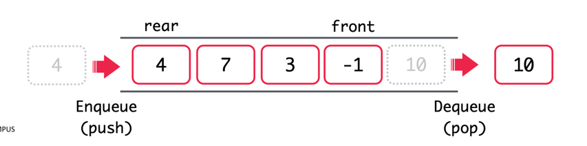
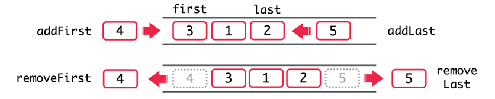
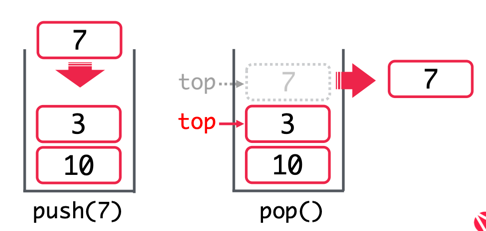
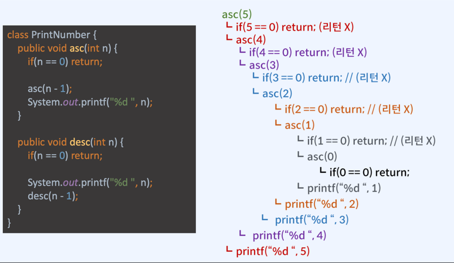
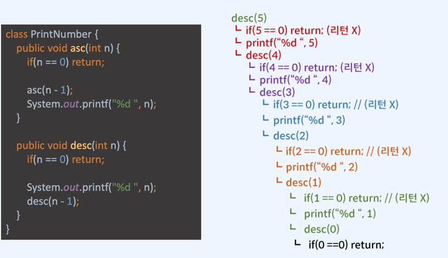
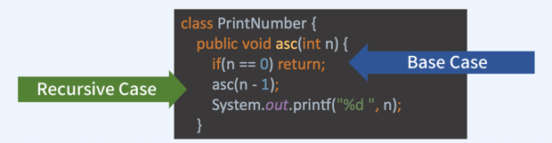
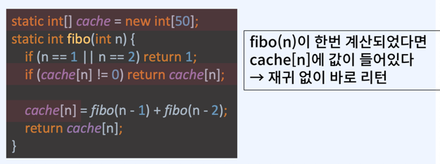

# ps
- - -
# Part 1.
## String
- java.lang 패키지
- immutable object
- StringBuilder(변경 가능한 문자열)
``` 
String str1 = new String("Hello");
String str2 = "Hello"; 
```
Literal로 생성한 문자열은 constant String pool에 저장되고, new로 생성한 문자열은 heap영역에 저장된다.
> Literal 문자열은 공통 pool에 같은 값이 있으면 연결, 없으면 생성하고, heap 영역 문자열은 매번 새로 생성한다.

| Method name                                            | Return value |
|--------------------------------------------------------|--------------|
| charAt(int index)                                      | char         | 
| length()                                               | int          |
| equals(Object anObject)                                | boolean      |
| compareTo(String anotherString                         | int          |
| toCharArray()                                          | char[]|
| toLowerCase(), to UpperCase()                          | String|
| contains(CharSequence s)                               | boolean|
| replace(CharSequence target, CharSequence replacement) | String|
| split(String regex)                                    |String[]|
| substring(int beginIndex, int endIndex)                | String|
| indexOf(int ch, int fromIndex)                         | int|
<br>

## Time Complexity
- 시간 복잡도: 입력 크기에 비해 수행 시간이 얼마나 걸리는지
  - 주로 `Big-O` 표기법 사용
  - 정의된 입력 데이터 중 가장 최악의 상황을 포함한 시간의 상한선
  - 편의상 1초에 약 1억번의 연산을 기준으로 소요시간 가늠

```
int N = str.length();
for (int i = 0; i < N; i++) {
    int alphabetIndex = str.charAt(i) - 'A';
    count[alphabetIndex]++;
}
```
> 시간 복잡도 분석
> - 반복문 조건식 검사: N + 1 번 <br>
> - 반복문 증감식: N 번 <br>
> - 반복문 내부 식: 2 * N <br>
> 
> 총합: O(4N + 2)  --[상수 제거]-->  O(N) 
<br>

> 시간 복잡도 추론
> - 1 < logN < $\sqrt{N}$ < N < NlogN < $N^2$ < N!

<br>

## Array
- 생성과 동시에 크기가 고정
- 데이터가 메모리상에 일렬로 저장

**배열의 연산**
1. get
   - 메모리가 연속적이기 때문에 배열의 시작 주소로부터 떨어진 원소의 주소를 계산
   - `시작 주소 + index * 자료형` -> `O(1)`
2. change
   - `시작 주소 + index * 자료형` -> `O(1)`
3. append
   - 배열이 꽉 차있을 경우에는 더 이상 추가 불가
   - `배열 길이 검사 + 값 추가` -> `O(1)`
4. insert
   - 배열의 중간에 값을 추가
     - 원하는 인덱스부터 끝 인덱스까지 인덱스를 뒤로 한 칸씩 이동 후 추가
   - `최악의 경우 모든 인덱스를 이동` -> `O(N)`
5. erase
   - 배열의 중간 값을 삭제
     - 원하는 인덱스를 삭제 후 삭제된 인덱스 뒤부터 앞으로 한 칸씩 이동
   - `최악의 경우 모든 인덱스를 이동` -> `O(N)`

**check 배열**
- 방문(존재) 여부 / 상태를 기록하기 위해 사용하는 배열
- boolean[] 이나 int[] 을 주로 사용
- 수의 범위를 배열의 크기로 설정
  - 배열 요소의 접근은 O(1)
  - ex. 1 ~ N 이라면 [N+1]로 설정

<br>

## Brute Force, Simulation
### 완전 탐색: 모든 경우의 수를 시도
  - 정답률 100% 보장
  - N개 중에서 M개를 고르는 경우 M중 for문이 필요 -> 재귀함수를 사용하면 가독성 향상
### 시뮬레이션
  - 요구사항을 확실히 분석

<br>

## Sort
- 데이터 집합을 적합한 순서로 배치하는 것

**정렬 알고리즘**
- $N^2$ 정렬 알고리즘
  - Bubble Sort, Selection Sort, Insertion Sort
- NlogN 정렬 알고리즘
  - Quick Sort, Merge Sort, Heap Sort
- 그외 알고리즘
  - Counting Sort, Radix Sort, Bucket Sort ...

**Arrays.sort**
- java.util 패키지
- 자료형
  - primitive[]
    - 오름차순 정렬
    - `un-stable`
    - `in-place`: 추가적인 메모리 공간을 거의 사용 X
    - Dual-Pivot Quick Sort -> 평균(NlogN), 최악($N^2$)
  - Object[]
    - 사전순 정렬
    - `stable`: 값이 같은 원소들의 기존 상대적 순서가 정렬 후에도 유지
    - Tim Sort(Merge Sort 기반) -> 평균(NlogN), 최악(NlogN)

**Set**
- java.util 패키지
- 중복된 원소를 가지지 않는 Collection
- add(), remove(), contains()
- 구현체
  - **HashSet**
    - Hash Table 기반의 un-ordered Collection
    - 삽입, 삭제, 조회 연산 -> 평균 O(1), 최악 O(N) 
    - null 저장 가능
  - **TreeSet**
    - Binary Search Tree 기반의 ordered Collection
    - 삽입, 삭제, 조회 연산 -> 항상 O(logN)
    - null 저장 X

**Map**
- java.util 패키지
- 중복된 key를 가지지 않고, <key, value> 쌍을 담는 Collection
- put(), remove(), containsKey()
- 구현체
  - **HashMap**
    - Hash Table 기반의 un-ordered Collection
    - 삽입, 삭제, 조회 연산 -> 평균 O(1), 최악 O(N)
    - null 저장 가능
    - key 순서가 보장 X
  - **TreeMap**
    - Binary Search Tree 기반의 ordered Collection
    - 삽입, 삭제, 조회 연산 -> 항상 O(logN)
    - null 저장 X
    - key가 `정렬된 순서`로 보장
  - **LinkedHashMap**
    - Hash Table + Double Linked List 기반의 ordered Collection
    - 삽입, 삭제, 조회 연산 -> 평균 O(1), 최악 O(N)
    - null 저장 가능
    - key가 `삽입된 순서`로 보장

<br>

## Prefix Sum
누적합 배열은 구간합 연산뿐만 아니라 [L, R] 구간의 연산 결과를 구하기 위해 [1, R] 연산에서 [1, L-1] 구간의 연산을 제거하는 복원작업이 가능한 다른 종류의 연산에도 적용할 수 있습니다.
> 교환법칙, 결합벅칙이 성립하며 역원이 존재하는 연산은 복원이 가능합니다. 
>  - 항등원: 연산에서 모든 원소와 연산해도 그 원소를 그대로 돌려주는 특별한 원소
>  - 역원: 어떤 원소와 연산했을 때 항등원을 만들어주는 원소

- **XOR(^) 연산**
  - 항등원: 0
  - 역원: 자기 자신
      > a ^ 0 = a <br>
        a ^ a = 0 <br>
        a ^ b ^ b = a
- **덧셈(+) 연산**
  - 항등원: 0
  - 역원: -a
- **곱셈(*) 연산**
  - 항등원: 1
  - 역원: 1/a

<br>

## Binary Search
Q. N개의 원소를 가진 배열에서 X라는 값이 있는지 알고 싶다면? <br>
(또는 해당 값보다 작은/큰 값의 개수는?) <br>
(또는 해당 값의 근삿값은?)

A1. 모든 원소를 차례로 탐색: O(N) <br>

A2. `정렬` 후 Binary Search(이진 탐색): O(logN)
- 중간 값을 기준으로 크기를 비교해 탐색 범위를 절반씩 줄여가며 찾는 방법 
- **일치하는 값**
  - 일치하는 값의 경우 이진 탐색보다 HashSet 자료구조의 contains()를 사용하는 것이 더 빠르다 -> 평균 O(1)
  ```
  int search(int[] arr, int X) {
     int l = 0, r = arr.length - 1;     // 폐구간 패턴 [l, r]
     while (l <= r) {         
         int m = (l + r) / 2;
         if (arr[m] < X) l = m + 1;
         else if (arr[m] > X) r = m - 1;
         else return m;
     }   
     return -1;
  }
  ```
  ```
  int idx = Arrays.binarySearch(arr, x);
  // 값이 존재하면 index, 없으면 -1 반환
  ```
- **lowerBound, upperBound**
  - lowerBound: x이상 중 최소값
  - upperBound: x초과 중 최소값
  - 중복 값이 없는 경우에는 TreeSet 자료구조의 메서드를 사용할 수도 있습니다.
    - ceiling(x): x 이상 중 최소값 → lowerBound(x)
    - floor(x): x 이하 중 최대값
    - higher(x): x 초과 중 최소값 → upperBound(x) 
    - lower(x): x 미만 중 최대값
  > 최적값(최소/최대)을 구하는 문제는 모두 최소값을 구하는 문제로 변환이 가능
  > - 최소값: lowerBound
  > - 최대값: upperBound - 1
  ```
  int lowerBound(int[] arr, int x) {
      int l = 0, r = arr.length;     // 반폐구간 패턴 [l, r)
      while (l < r) {          
          int m = (l + r) / 2;
          if (arr[m] >= x) r = m;
          else l = m + 1;
      }
      return l;
  }
  
  int upperBound(int[] arr, int x) {
      int l = 0, r = arr.length;     // 반폐구간 패턴 [l, r)
      while (l < r) {          
          int m = (l + r) / 2;
          if (arr[m] > x) r = m;
          else l = m + 1;
      }
      return l;
  }
  ```
    > Tip) 주로 최적값을 구할 때는 반폐구간 패턴을 사용 (r = max + 1 로 설정)
    >   - `[l, r)`
    >   - while (l `<` r)
    >   - if 조건식
    >     - 최소(lowerBound): 등호 포함
    >     - 최대(upperBound): 등호 미포함
    >   - `r = m`, `l = m + 1`
    >   - return `l`;

<br>

## Parametric Search
최적값 문제를 `값 X가 답이 될 수 있는가?` 라는 결정 문제로 바꾼 뒤, 그 값을 Binary Search를 사용하여 찾는 방법
> 기존의 Binary Search와 다른 점은 처음 주어진 배열 arr의 원소 중에서 최적값을 찾는 것이 아닌, 별도의 구하고자 하는 값의 최적값을 찾아야 하는 점입니다.
> 따라서 l과 r의 범위를 직접 설정해야 합니다.
> - ex. 백준 2805: 주어진 나무의 높이 배열에서의 최적값이 아닌, 절단기에 설정할 수 있는 높이(h)의 최적값을 구하는 문제
- 문제 접근 방법
  1. 구하고자 하는 값의 범위를 설정: `[l, max + 1)`
  2. 최소값: `l`, 최대값: `l - 1`

> Tip) while문 안의 if 조건식
> - lowerBound(이상), upperBound(초과) 모두 비교값(x)보다 작으면 안된다
> - 조건식에 사용되는 함수가 m과 정비례인지 반비례인지 구분
> - **함수 결과가 비교값(x) 보다 작은 경우**, 함수의 결과가 커져야 한다
>   - 정비례: m이 증가해야 함수 결과도 증가 -> `l = m + 1;`
>   - 반비례: m이 감소해야 함수 결과가 증가 -> `r = m;`

<br>

## Two Pointer
배열이나 리스트 같은 연속된 자료구조에서 두 개의 인덱스를 관리하여 특정 조건을 만족하는 부분집합이나 특정 값을 찾는 알고리즘
- 시간 복잡도를 보통 O(N²)에서 `O(N)`으로 최적화 가능
- 문제 접근 방법
  1. 두 포인터(인덱스)를 배열의 시작/끝, 또는 같은 출발점에서 초기화
     - l = 0, r = 0;
     - l = 0, r = N - 1;
  2. 규칙에 따라 포인터를 이동
     - 같은 배열에서 동일한 방향으로 이동
     - 같은 배열에서 마주보는 방향으로 이동
     - 서로 다른 배열에서 이동
  3. 두 포인터 중 하나 혹은 둘 다 끝에 도달할 때까지 반복

- Pattern
  1. 같은 출발점
      ```
      int r = 0;
      for (int i = 0; i < N; i++) {
          while (r < N && 조건식) {
              // 코드
              r++;     
          }
      }
      ```
     > Point.
     > - 주로 이상/이하 조건에서 사용 (슬라이딩 윈도우)
     > 1. for문으로 인덱스(`int i`)로 `int l`을 대체하고, `int r = 0;`만 선언
     > 2. while 조건식: `r < N`, while문 내부에서 r값 증가: `r++`
  2. 시작/끝
      ```
      int l = 0, r = N - 1;
      while (l < r) {
          if (조건식) r--;
          else if (조건식) l++;
          else break;
      }
      ```
     > Point.
     > - 주로 정확한 매칭 조건에서 사용 (수렴 패턴)
     > 1. l과 r 모두 직접 선언: `int l = 0, r = N - 1;`
     > 2. while 조건식: `l < r`, while문 내부에서 l값 증가, r값 감소: `l++`, `r--`

<br>

## List
동일한 타입의 여러 원호를 선형 집합으로 관리하는 동적 데이터 구조
- 원소가 추가/삭제됨에 따라 크기가 변경될 수 있다.
- 구현체
  - **ArrayList**: index를 통한 원소 접근이 빠르지만, 원소의 삽입/제거가 느림
  - **LinkedList**: index를 통한 원소 접근이 느리지만, 원소의 삽입/제거가 빠름
  - Vector: ArrayList와 비슷하며 thread-safe 하기에 비교적 느릴 수 있음
- 순서가 있는 Collection 인덱스를 통한 원소 접근 가능
- 동일한 원소 저장 가능
- ListIterator 제공

1. ArrayList
- 동적 배열을 사용한 List 구현체
- [ArrayList 구현 예제](https://github.com/Acka1357/codingtest-java-20/blob/main/%EC%9A%94%EC%95%BD%EB%85%B8%ED%8A%B8/%EB%9D%BC%EC%9D%B4%EB%B8%8C%EB%9F%AC%EB%A6%AC_%EA%B5%AC%ED%98%84%EC%98%88%EC%A0%9C/MyArrayList.java)

2. LinkedList
- 차례로 연결된 Node를 사용한 구현체
- [SingleLinkedList 구현 예제](https://github.com/Acka1357/codingtest-java-20/blob/main/%EC%9A%94%EC%95%BD%EB%85%B8%ED%8A%B8/%EB%9D%BC%EC%9D%B4%EB%B8%8C%EB%9F%AC%EB%A6%AC_%EA%B5%AC%ED%98%84%EC%98%88%EC%A0%9C/MySingleLinkedList.java)
- [DoubleLinkedList 구현 예제](https://github.com/Acka1357/codingtest-java-20/blob/main/%EC%9A%94%EC%95%BD%EB%85%B8%ED%8A%B8/%EB%9D%BC%EC%9D%B4%EB%B8%8C%EB%9F%AC%EB%A6%AC_%EA%B5%AC%ED%98%84%EC%98%88%EC%A0%9C/MyDoubleLinkedList.java)

| Operations            | Array | ArrayList | LinkedList |
|-----------------------|-------|-----------|------------|
| get(int idx)          | O(1)  | O(1)      | O(N)       |
| add(E e)              | O(1)  | O(1)      | O(1)       |
| insert(int idx, E e)  | O(N)  | O(N)      | O(N)       |
| insert(Iter it, E e)  | O(N)  | O(N)      | O(1)       |
| remove(int idx)       | O(N)  | O(N)      | O(N)       |
| remove(int it)        | O(N)  | O(N)      | O(1)       |

- 실제 구현체에서는 insert() 대신 add()의 오버로딩 메서드로 제공됩니다.
> ArrayList의 add는 capacity가 다 찼을 경우 O(N)이나, 평균적인 복잡도는 O(1)로 볼 수 있습니다.

<br>

## Queue
먼저 넣은 데이터가 먼저 나오는 `선입선출` 자료구조 (`First-In First-Out`)
- 대기열의 가장 뒤에 원소가 추가되고, 가장 앞의 원소부터 처리
- 요청의 입력/도달 순서대로 처리하는 상황에 유용
- ex) 티켓팅 대기열, 프린터 출력 처리, 운영체제 스케줄링, 메세지 큐 등등

- Operations
  - **Insert**
    - add(e): 원소를 큐에 추가 (큐에 공간이 없다면 Exception 발생)
    - offer(e): 원소를 큐에 추가 (큐에 공간이 없다면 false 반환)
  - **Remove**
    - remove(): 큐의 head 원소를 제거하고 반환 (큐가 비었다면 Exception 반환)
    - poll(): 큐의 head 원소를 제거하고 반환 (큐가 비었다면 null 반환)
  - **Examine**
    - element(): 큐의 head 원소 반환 (큐가 비었다면 Exception 반환)
    - peek(): 큐의 head 원소 반환 (큐가 비었다면 null 반환)

1. LinkedList 기반의 Queue
   - enqueue: addLast를 사용해 리스트의 가장 마지막에 원소를 추가
   - dequeue: removeFirst를 사용해 리스트의 가장 앞 원소를 삭제
   - [구현 예제](https://github.com/Acka1357/codingtest-java-20/blob/main/%EC%9A%94%EC%95%BD%EB%85%B8%ED%8A%B8/%EB%9D%BC%EC%9D%B4%EB%B8%8C%EB%9F%AC%EB%A6%AC_%EA%B5%AC%ED%98%84%EC%98%88%EC%A0%9C/MyListQueue.java)
   - [사용 예제](https://github.com/Acka1357/codingtest-java-20/blob/main/%EC%9A%94%EC%95%BD%EB%85%B8%ED%8A%B8/%EB%9D%BC%EC%9D%B4%EB%B8%8C%EB%9F%AC%EB%A6%AC_%EC%82%AC%EC%9A%A9%EC%98%88%EC%A0%9C/Queue.java)
2. Array 기반의 Queue
   - enqueue: rearIndex에 원소를 추가하고, rearIndex를 이동
   - dequeue: firstIndex의 원소를 삭제하고, firstIndex를 이동
   - [구현 예제](https://github.com/Acka1357/codingtest-java-20/blob/main/%EC%9A%94%EC%95%BD%EB%85%B8%ED%8A%B8/%EB%9D%BC%EC%9D%B4%EB%B8%8C%EB%9F%AC%EB%A6%AC_%EA%B5%AC%ED%98%84%EC%98%88%EC%A0%9C/MyArrayQueue.java)



<br>

## Deque (Double Ended Queue)
양쪽 끝에 원소를 삽입/제거할 수 있는 양방향 Queue
- push/pop을 각각 addLast/removeFirst로만 이용하면 FIFO
- Queue는 단방향 List만으로 구현할 수 있지만, Deque는 prev/next를 모두 관리하는 양방향 List가 필요

- Operations
  - **Insert**
    - addFirst/addLast(E e): 원소를 덱의 대기열 앞/뒤에 추가 (덱에 공간이 없다면 Exception 발생)
    - offerFirst/offerLast(E e): 원소를 덱의 대기열 앞/뒤에 추가 (덱에 공간이 없다면 false 반환)
  - **Remove**
    - removeFirst/removeLast(): 덱의 대기열 가장 앞/뒤 원소를 제거하고 반환 (덱이 비었다면 Exception 발생)
    - pollFirst/pollLast(): 덱의 대기열 가장 앞/뒤 원소를 제거하고 반환 (덱이 비었다면 null 반환)
  - **Examine**
    - getFirst/getLast(): 덱의 대기열 가장 앞/뒤 원소 반환 (덱이 비었다면 Exception 발생)
    - peekFirst/peekLast(): 덱의 대기열 가장 앞/뒤 원소 반환 (덱이 비었다면 null 반환)

1. LinkedList 기반의 Deque
   - addFirst/addLast: 리스트의 가장 앞/뒤에 새 노드를 연결하여 추가
   - removeFirst/removeLast: 리스트의 가장 앞/뒤 노드에 대한 연결을 끊어 삭제
   - [구현 예제](https://github.com/Acka1357/codingtest-java-20/blob/main/%EC%9A%94%EC%95%BD%EB%85%B8%ED%8A%B8/%EB%9D%BC%EC%9D%B4%EB%B8%8C%EB%9F%AC%EB%A6%AC_%EA%B5%AC%ED%98%84%EC%98%88%EC%A0%9C/MyListDeque.java)
   - [사용 예제](https://github.com/Acka1357/codingtest-java-20/blob/main/%EC%9A%94%EC%95%BD%EB%85%B8%ED%8A%B8/%EB%9D%BC%EC%9D%B4%EB%B8%8C%EB%9F%AC%EB%A6%AC_%EC%82%AC%EC%9A%A9%EC%98%88%EC%A0%9C/Deque.java)
2. Array 기반의 Deque
   - addFirst/addLast: firstIndex/lastIndex에 원소를 추가하고 인덱스를 이동
   - removeFirst/removeLast: firstIndex/lastIndex의 원소를 삭제하고 인덱스를 이동
   - [구현 예제](https://github.com/Acka1357/codingtest-java-20/blob/main/%EC%9A%94%EC%95%BD%EB%85%B8%ED%8A%B8/%EB%9D%BC%EC%9D%B4%EB%B8%8C%EB%9F%AC%EB%A6%AC_%EA%B5%AC%ED%98%84%EC%98%88%EC%A0%9C/MyArrayDeque.java)



<br>

## Stack
마지막에 넣은 데이터가 먼저 나오는 `후입선출` 자료구조 (`Last-In First-Out`)
- java.util의 Vector를 상속받은 클래스
- 대기열의 가장 위에 원소가 추가되고, 가장 위의 원소부터 처리
- 기록을 쌓아가며 직전의 상태를 복원해야하는 상황에 유용
- ex) 웹 브라우저 뒤로 가기, 프로그램 실행 취소, 함수 호출 등등
> LIFO stack의 경우 성능상 Deque 인터페이스를 사용하여 구현하는 것을 권장

- Operations
    - **Insert**
      - push(): 원소를 스택의 가장 위에 추가 (필요시 자동으로 크기 확장)
    - **Remove**
      - pop(): 스택의 가장 위의 원소를 제거하고 반환 (스택이 비었다면 Exception 발생)
    - **Examine**
      - peek(): 스택의 가장 위의 원소 반환 (스택이 비었다면 Exception 발생)

1. LinkedList 기반의 stack
   - push: addLast를 사용해 리스트의 가장 마지막에 원소를 추가
   - pop: removeLast를 사용해 리스트의 가장 뒷 원소를 삭제
2. Array 기반의 stack
   - push: topIndex를 증가시키고 원소를 추가
   - pop: topIndex의 원소를 삭제하고 topIndex를 감소
   - 사이즈를 따로 관리하지 않아도 topIndex를 통해 알 수 있다



> **Tip.** <br>
> 기본적으로 Queue, Deque, Stack에서 배열 기반의 `ArrayDeque` 구현체를 사용하는 것이 메모리 연속성 덕분에 캐시 효율이 높고, 
> 포인터 오버헤드가 없어 LinkedList 기반의 구현체를 사용하는 것보다 빠릅니다.
> - Queue 메서드 제공: offer(), poll(), peek()
> - Deque 메서드 제공: addFirst(), addLast()
> - Stack 메서드 제공: push(), pop()

<br>

## 재귀함수 (Recursion)
자기 자신을 호출하는 함수
- 사용 이유
  1. 하나의 커다란 문제를 작은 문제로 나누어 해결
  2. 문제를 귀납적으로 생각하기 위해서
     - (i-1), (i-2)번째 결과를 활용하여 (i)번째 답을 구함
- 재귀함수 예시
  1. 재귀함수 이후 출력
     
  2. 재귀함수 이전 출력
     

> **Tip**. 재귀함수를 잘 설계하는 방법 <br>
>  
> - **Base Case**
>   - 일반적으로 재귀 호출이 필요 없는 마지막 입력값일 때의 케이스
>   - 재귀 호출을 멈추고 함수가 종료되는 조건으로, 적어도 하나 이상의 Base Case가 존재해야 한다
> - **Recursive Case**
>   - 재귀 호출이 일어나는 부분으로, 함수가 호출될수록 Base Case에 수렴해야 한다
>   - > 재귀 호출 인자에 ++, -- 연산을 하게되면 형제 분기들이 사용할 부모 상태값이 오염되어 오답이 발생하니 (++x) 대신에 (x + 1)을 인자로 전달
>   - > 재귀 호출 인자로 전달될 공통된 값들은 클래스 변수로 선언하여 사용 
> > 중복 계산 방지를 위해 동일한 계산이 반복될 가능성이 있다면 메모리에 저장
> 

<br>

## 순열 (Permutation)
집합 안에서 가능한 모든 조합을 나열하는 것
- 특징
  - 중복이 없는 n개의 원소 집합에서는 n!개의 순열이 생성됨
  - 중복된 원소가 있는 경우에는 각 원소의 {중복횟수!}의 곱으로 나눈 값의 개수만큼 순열이 생성됨
  - ex) {1, 1, 2, 2, 2, 3}
    - 6! / (2! * 3! * 1!) = 60
      - 1의 중복 개수: 2
      - 2의 중복 개수: 3
      - 3의 중복 개수: 1

